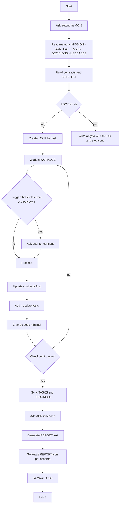

# Codex Cloud Agent + Memory Bank (optimized)

Агент для Codex Cloud в стиле SDD: **Contracts → Tests → Code → ADR → Progress**, с расширенным мемори‑банком `.memory/` и строгими правилами автономности 0/1/2.

## Дерево проекта

```text
.
├── contracts/
│   └── VERSION.json
├── AGENTS.md
└── .memory/
    ├── AUTONOMY.md
    ├── CONTEXT.md
    ├── DECISIONS.md
    ├── GLOSSARY.md
    ├── INDEX.yaml
    ├── MISSION.md
    ├── PROGRESS.md
    ├── REPORT_SCHEMA.json
    ├── REPORT_TEMPLATE.md
    ├── TASKS.md
    ├── USECASES.md
    └── WORKLOG.md
```

## Как это работает — кратко

1. Codex читает `AGENTS.md` и спрашивает степень автономности 0/1/2.
2. Читает `.memory/*` и `contracts/*`, следует ритуалу **Contracts → Tests → Code**.
3. Создаёт `LOCK.taskId`, ведёт черновик шагов в `WORKLOG.md` до checkpoint.
4. Если меняются публичные интерфейсы — сначала правит `contracts/*` и версии в `contracts/VERSION.json` по SemVer.
5. После checkpoint синхронизирует `TASKS.md`, `PROGRESS.md`, оформляет ADR в `DECISIONS.md`.
6. Возвращает финальный ответ по шаблону `REPORT_TEMPLATE.md` и прикладывает `REPORT.json` по схеме `REPORT_SCHEMA.json`.

## Mermaid диаграмма процесса



## Быстрый чек‑лист

* Перед началом: спроси автономность, прочитай `.memory/*` и `contracts/*`.
* Любые изменения публичных интерфейсов — сначала `contracts/*` и SemVer.
* До checkpoint пиши только в `WORKLOG.md`; после — синхронизируй канбан и прогресс.
* Всегда формируй финальный отчёт: текст + `REPORT.json`.

## Политика PR (сверхкратко)

* Один PR — одна цель; unit + contract тесты зелёные; контракты/ADR/прогресс обновлены.
* В описании PR: цель, влияние на API и данные, риски, план отката, миграции.
